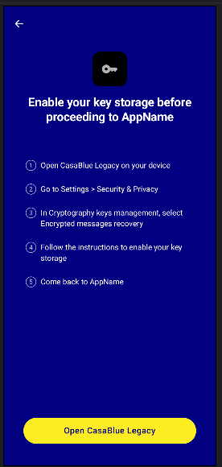
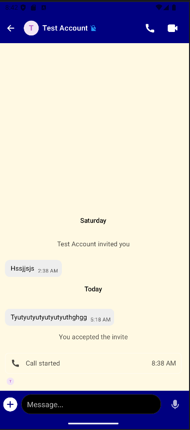
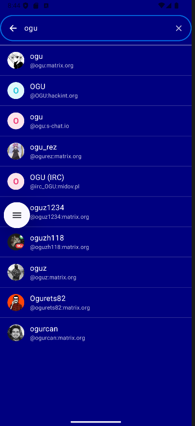

# CasaBlue

**CasaBlue** is a next-generation Android Matrix client that combines the modern performance of [Element X](https://github.com/element-hq/element-x-android) with the advanced power-user features of [SchildiChat](https://schildi.chat/).

Built with Jetpack Compose and the Matrix Rust SDK, CasaBlue offers a lightning-fast experience with a deep focus on customization and privacy.

---

## 📸 Screenshots

<p align="center">
  
  
  
</p>

---

## ✨ Features

### 🎨 Enhanced UI & Customization
- **Neutral Schildi Theme**: More balanced colors and design tweaks for better readability.
- **Customizable Message Bubbles**: Set your own colors for incoming and outgoing messages.
- **Faster Transitions**: Optimized screen animations for a smoother feel.
- **Advanced Theming**: Toggle between light, dark, and true black themes.

### 💬 Improved Chat Experience
- **Bottom Space Bar**: Swipe-based navigation with full support for hierarchical spaces.
- **Smart Filtering**: Quick access to favorites, unread messages, DMs, and groups.
- **Native Message Rendering**: High-performance rendering of spoilers, collapsible `<details>`, tables, and inline images.
- **Floating Date Headers**: Easily keep track of time while scrolling through long conversations.

### 🔒 Privacy & Performance
- **Matrix Rust SDK**: Leverages a high-performance core for encryption and synchronization.
- **UnifiedPush Support**: Uses FOSS FCM distributor, avoiding proprietary Google libraries where possible.
- **No Analytics**: Privacy-first approach with analytics disabled by default.

---

## 🚀 Getting Started

### Prerequisites
- Android Studio Ladybug (2024.2.1) or newer.
- JDK 17+.
- A device or emulator with at least 2GB RAM.

### Build Instructions
1. Clone the repository:
   ```bash
   git clone https://github.com/ozingaxs/CasaBlue.git
   ```
2. Open the project in **Android Studio**.
3. Let Gradle sync and download dependencies.
4. Select a build variant (e.g., `fdroidScDefaultDebug`).
5. Click **Run** to deploy to your device.

---

## 🛠 Technical Stack
- **Language**: 100% Kotlin.
- **UI Framework**: Jetpack Compose.
- **Architecture**: MVI (Molecule) + Appyx for navigation.
- **Core**: Matrix Rust SDK.

---

## 📄 License
This project is licensed under the [AGPL-3.0-only](LICENSE) or [Element Commercial License](LICENSE-COMMERCIAL).
Please see the license files for full details.
